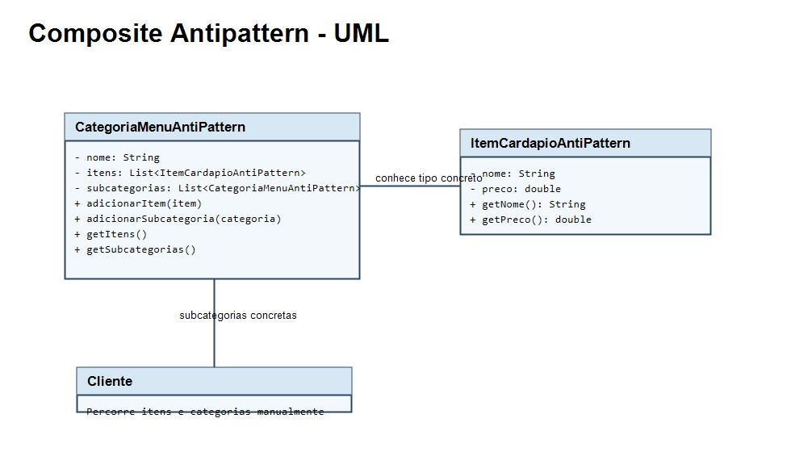

# Composite Antipattern

O antipadrao do Composite ocorre quando objetos folha e objetos compostos nao compartilham uma interface comum. Assim, o cliente precisa conhecer cada tipo concreto e tratar categorias e itens manualmente, aumentando o acoplamento e a duplicacao de logica.



## Como executar

Na pasta `CompositeAntiPadrao`:

```bash
javac -d out src/main/java/org/example/*.java
java -cp out org.example.Main
```
