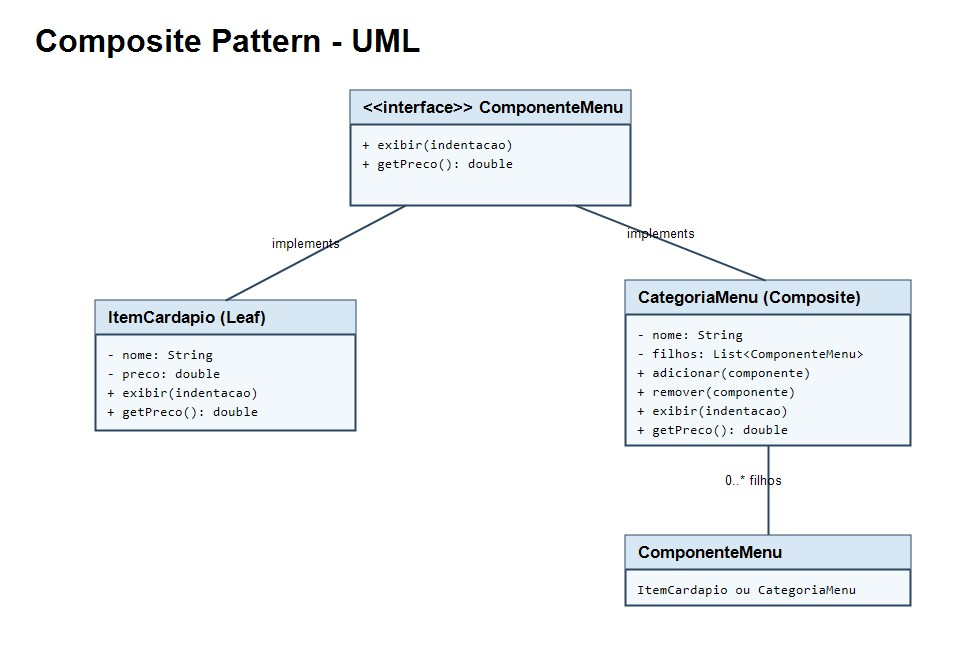

# Composite Pattern

Padrao de projeto estrutural que permite tratar objetos individuais e grupos de objetos da mesma forma. No exemplo, `ItemCardapio` e `CategoriaMenu` implementam a interface `ComponenteMenu`, permitindo montar uma arvore de categorias, subcategorias e itens.



## Como executar

Na pasta `CompositePadrao`:

```bash
javac -d out src/main/java/org/example/*.java
java -cp out org.example.Main
```
