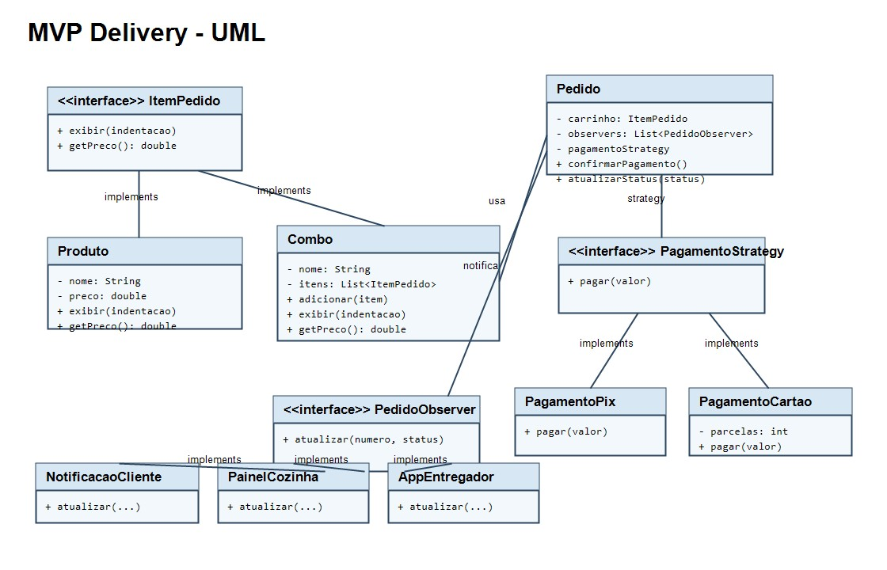

# MVP - Delivery com Padroes de Projeto

Este MVP simula um pedido de delivery usando os tres padroes presentes no repositorio:

- **Composite**: `Produto` e `Combo` implementam `ItemPedido`, permitindo montar um carrinho com produtos simples e combos.
- **Strategy**: `Pedido` usa `PagamentoStrategy` para trocar a forma de pagamento entre Pix e cartao.
- **Observer**: `Pedido` notifica `NotificacaoCliente`, `PainelCozinha` e `AppEntregador` sempre que o status muda.



## Como executar

Na pasta `MVPDelivery`:

```bash
javac -d out src/main/java/mvp/*.java
java -cp out mvp.Main
```

## Fluxo demonstrado

1. O carrinho e montado com produtos e um combo.
2. O pedido calcula o total usando a arvore do Composite.
3. A forma de pagamento e escolhida via Strategy.
4. Cada mudanca de status dispara notificacoes via Observer.
