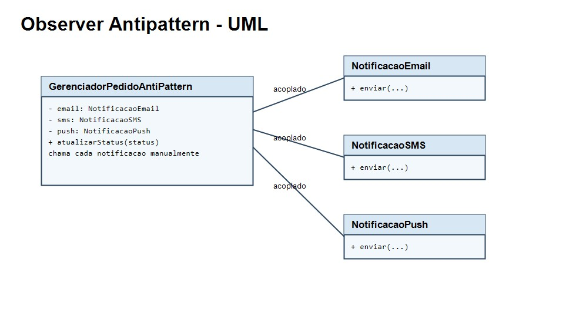

# Observer Antipattern

O antipadrao do Observer ocorre quando o objeto observado conhece diretamente os tipos concretos dos seus observadores. No exemplo, `GerenciadorPedidoAntiPattern` chama email, SMS e push manualmente, criando acoplamento forte.



## Como executar

Na pasta `ObserverAntiPadrao`:

```bash
javac -d out src/main/java/org/example/*.java
java -cp out org.example.Main
```
