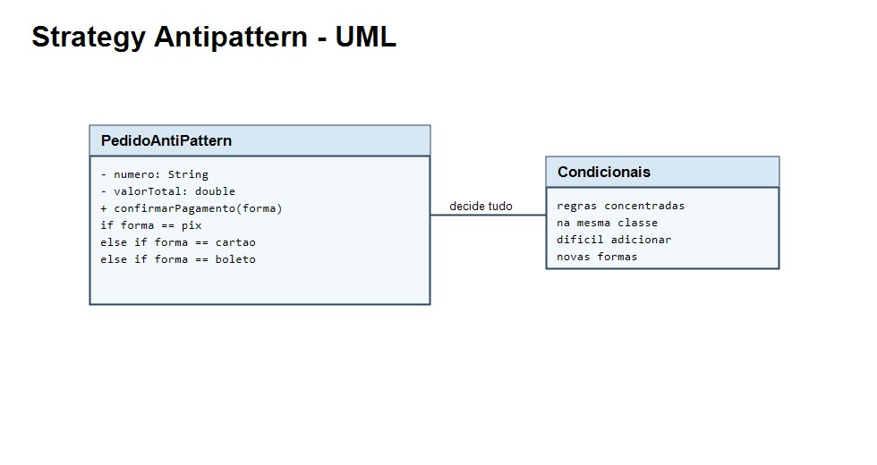

# Strategy Antipattern

O antipadrao do Strategy ocorre quando a classe principal concentra as regras dos algoritmos em condicionais. No exemplo, `PedidoAntiPattern` decide a forma de pagamento com `if/else`, dificultando a adicao de novos pagamentos.



## Como executar

Na pasta `StrategyAntiPadrao`:

```bash
javac -d out src/main/java/org/example/*.java
java -cp out org.example.Main
```
