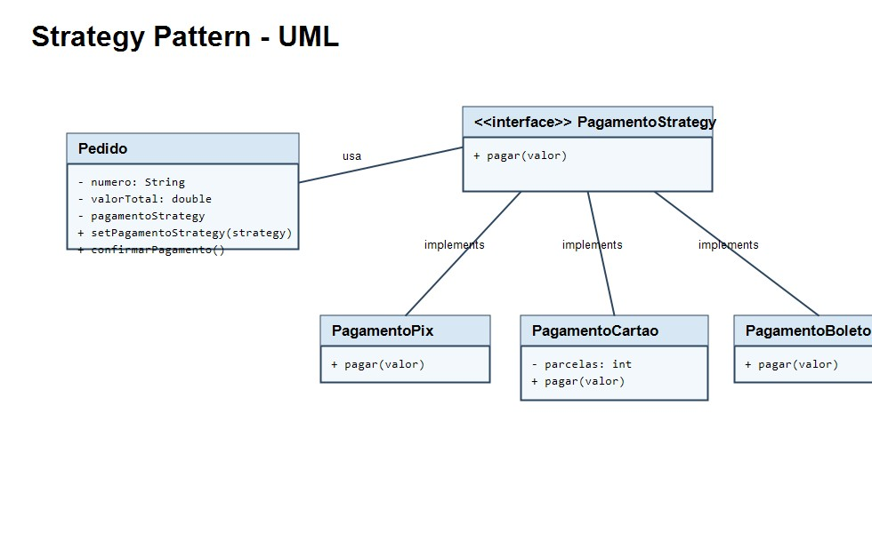

# Strategy Pattern

Padrao de projeto comportamental que permite definir uma familia de algoritmos, coloca-los em classes separadas e torna-los intercambiaveis em tempo de execucao. No exemplo, `Pedido` troca a forma de pagamento entre Pix, cartao e boleto usando `PagamentoStrategy`.



## Como executar

Na pasta `StrategyPadrao`:

```bash
javac -d out src/main/java/org/example/*.java
java -cp out org.example.Main
```
